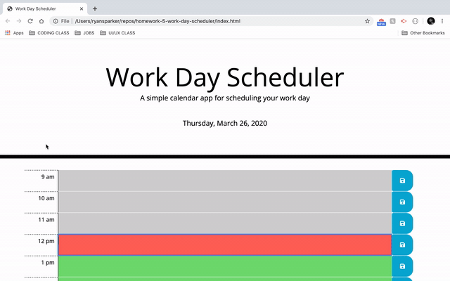
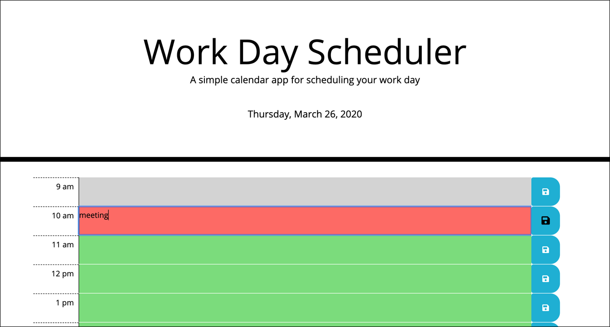

# Work Day Scheduler

This is a simple calendar application that allows the user to save events for each hour of the day. This app will run in the browser and feature dynamically updated HTML and CSS powered by jQuery.

## Usage 

Use this scheduler to organise your events for the day to keep you on task. At the start of your work day, type in all of the activites that will occur. The heading on the page displays the current date.

You can see what has happened and what is coming up easily through the color coding of the rows:

    gray   =   past
    red    =   current hour
    green  =   future

The following animation demonstrates the application functionality:

## Credits

APIs:
https://momentjs.com/

Websites:
https://stackoverflow.com/questions/27830335/how-to-get-name-of-the-day-from-date-with-momentjs

Tutorials:
https://www.youtube.com/watch?v=k8yJCeuP6I8

https://www.youtube.com/watch?v=9JRvJ9aMLzc

## Images

## URL

https://ryansparker.github.io/work-day-scheduler/

## GitHub Repository

https://github.com/ryansparker/work-day-scheduler

- - -
© 2020 Ryan Parker All Rights Reserved.
